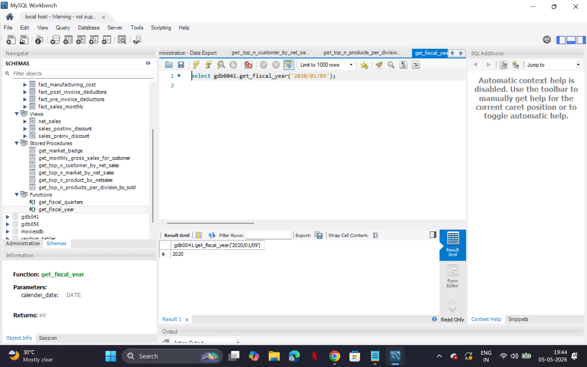
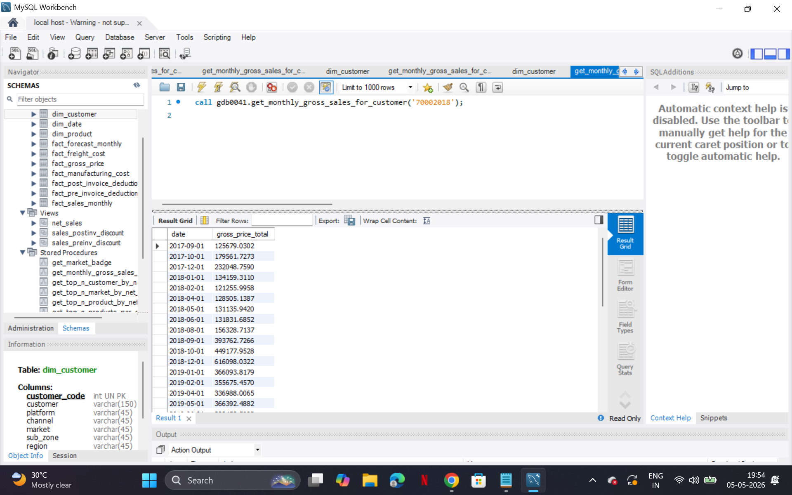
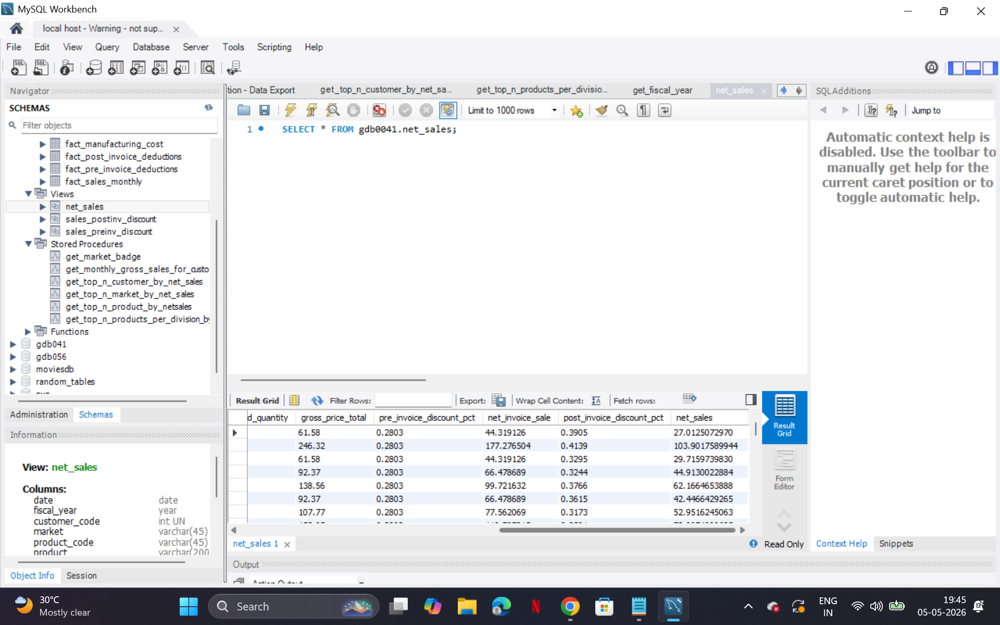
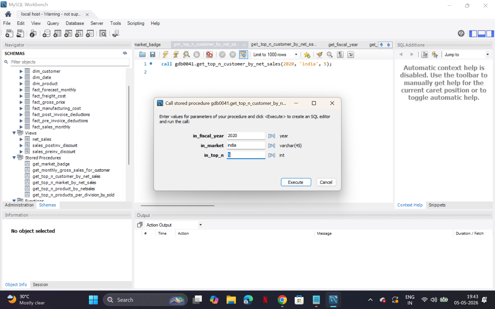
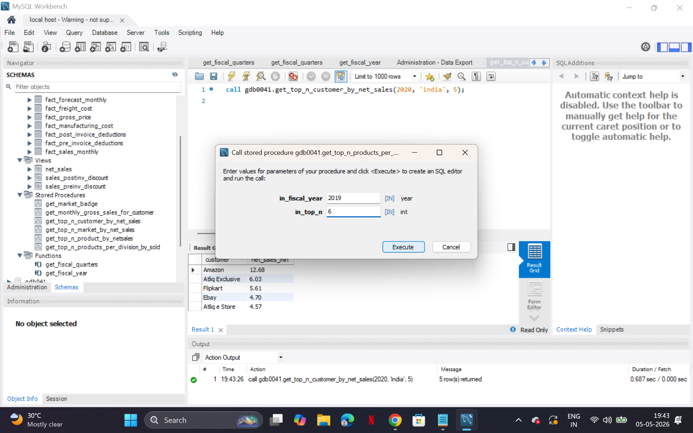
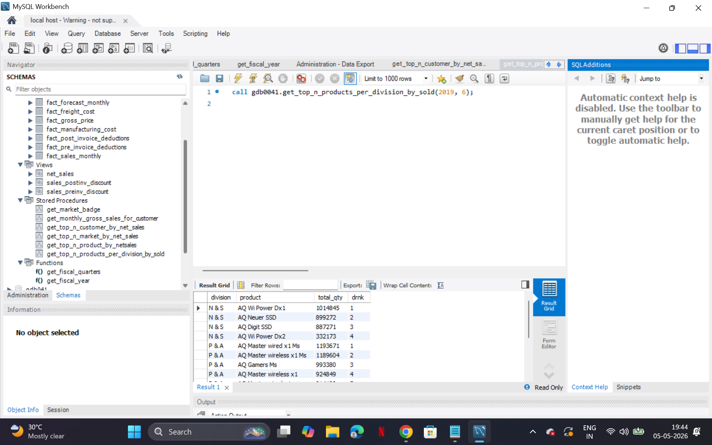

# 🛒 Consumer Goods Sales Analysis | SQL Project

## 📊 Overview
This project analyzes sales data of a consumer goods company using SQL to generate actionable business insights.

It simulates real-world analyst tasks by solving business-driven questions related to revenue, customer performance, and product trends.

---

## 🧠 Business Objective
- Track sales performance across customers and products  
- Identify top revenue contributors  
- Analyze monthly sales trends  
- Support pricing and discount decisions  

---

## 🛠️ Tech Stack
- SQL (MySQL)
- MySQL Workbench
- GitHub

---

## 🗃️ Data Model
- `fact_sales_monthly` → Sales transactions  
- `fact_gross_price` → Product pricing  
- `dim_customer` → Customer details  

📄 Schema file: `Database_Schema.sql`

---

## ⚙️ Core Features

### 🔹 Views
- Net Sales View  
- Discount Calculation Views  

👉 Simplifies complex calculations

---

### 🔹 Stored Procedures
- Top N Customers  
- Top N Products  
- Monthly Sales Analysis  

👉 Automates business queries

---

### 🔹 User Defined Function
- Fiscal Year Calculation  

---

### 🔹 Advanced SQL
- RANK()
- DENSE_RANK()
- ROW_NUMBER()

---

## 📈 Key Insights
- Top customers contributing maximum revenue  
- Monthly sales trends for demand analysis  
- High-performing products for business focus  

---

# 📸 Project Outputs with Explanation

---

## 🔹 Fiscal Year Function


**What it shows:**  
A user-defined SQL function that converts a given date into its fiscal year.

**Why it matters:**  
Businesses often follow a financial year instead of a calendar year. This function ensures consistent reporting across all queries.

---

## 🔹 Monthly Gross Sales Analysis


**What it shows:**  
Monthly revenue generated by a specific customer.

**Why it matters:**  
Helps identify seasonal trends, growth patterns, and customer performance over time.

---

## 🔹 Net Sales View


**What it shows:**  
A combined dataset of gross sales after applying pre- and post-invoice discounts.

**Why it matters:**  
Gives the *actual revenue* figure used for business decisions instead of raw sales numbers.

---

## 🔹 Stored Procedure Execution


**What it shows:**  
Execution of a stored procedure that calculates net sales dynamically.

**Why it matters:**  
Reduces manual query effort and allows reusable, parameterized analysis.

---

## 🔹 Top Customers by Net Sales


**What it shows:**  
Ranking of customers based on total revenue.

**Why it matters:**  
Helps identify high-value customers and prioritize business relationships.

👉 Uses **Window Function (RANK)**

---

## 🔹 Top N Products


**What it shows:**  
List of top-performing products based on sales.

**Why it matters:**  
Supports inventory planning and marketing strategy.

---

## 🪟 Window Function Example

```sql
SELECT 
    customer,
    SUM(net_sales) AS total_sales,
    RANK() OVER (ORDER BY SUM(net_sales) DESC) AS rank_order
FROM net_sales
GROUP BY customer;
